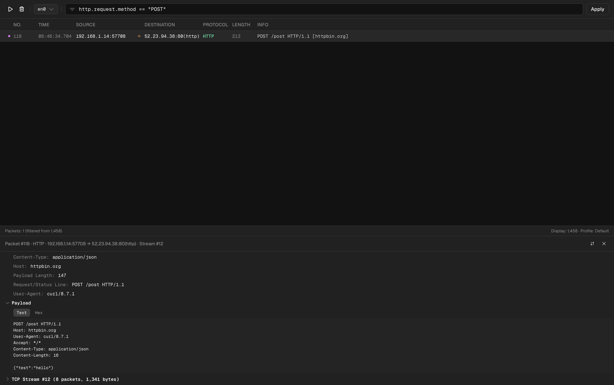
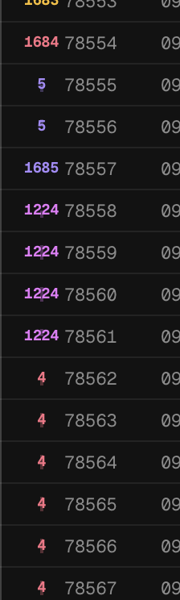

# vvvv

A modern, web-based network protocol analyzer. Think Wireshark - but in your browser.



## Architecture

| App | Description |
|---|---|
| **`apps/core`** | Go service - captures packets via libpcap, decodes protocols, and streams events over WebSocket. |
| **`apps/web`** | Next.js dashboard at [vvvv.joachimhodana.com](https://vvvv.joachimhodana.com) - real-time packet table, filtering, and deep inspection. |
| **`packages/*`** | Shared configuration and tooling. |

## Supported Protocols

ARP · ICMP · ICMPv6 · TCP · UDP · DNS · MDNS · TLS · HTTP · WebSocket · SSE · DHCP · SSH · SMTP · FTP · IMAP · POP3 · NTP · SSDP

## Tech Stack

- **Core** - Go, gopacket / libpcap
- **Web** - Next.js, React, TypeScript, Tailwind CSS, Zustand, TanStack Virtual
- **Tooling** - Bun, Turborepo

## Getting Started

### Prerequisites

- [Go](https://go.dev) 1.22+
- [Bun](https://bun.sh)
- libpcap (pre-installed on macOS; `apt install libpcap-dev` on Linux)

### Install & Run

```bash
# install JS dependencies
bun install

# start the Go capture core (requires admin/root privileges for live capture)
cd apps/core && sudo go run ./cmd/vvvv

# start the web UI (separate terminal)
bun dev
```

## How it works

### Privileges (important)

`apps/core` uses libpcap for live capture, so it typically needs to run as **root/admin**:

- macOS/Linux: `sudo ...`
- Windows: run your terminal as Administrator

### Traces / TCP streams

The leftmost column in the table is a **trace**:



- **dots/lines with the same color** belong to the **same TCP stream** (same conversation)
- in the packet details panel you can click **Follow TCP Stream** (↕) to apply `tcp.stream == N`

### Filters (display filters, Wireshark-style)

Filters are Wireshark-style display filters (post-capture). Examples:

- `http`
- `dns || http`
- `!arp`
- `ip.addr == 192.168.1.10`
- `ip.src == 192.168.1.10 && tcp.port == 80`
- `http.request.method == "POST"` (alias: `req.http.method`)
- `tcp.stream == 12`

### Note: HTTPS

For **HTTPS** traffic you won’t see fields like `http.request.method` or `http.status` because the payload is encrypted in TLS (same as Wireshark without TLS keys).

If you want to quickly verify HTTP decoding, use plain HTTP (port 80), e.g.:

```bash
curl http://httpbin.org/get
curl -X POST http://httpbin.org/post -d '{"test":"hello"}' -H "Content-Type: application/json"
```

### Running Tests

```bash
# Go tests (requires cgo + libpcap)
cd apps/core && go test ./...
```

## License

MIT License. Contributions are welcome.
